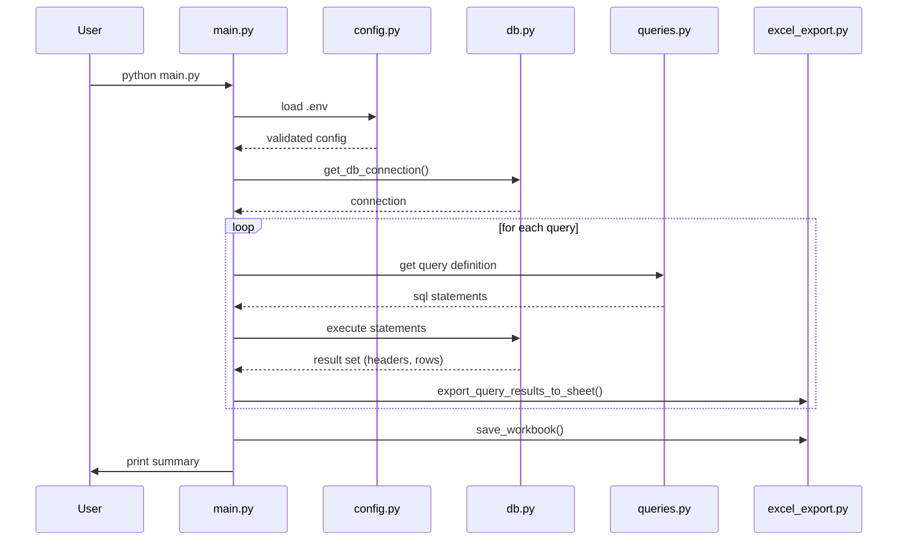

# PostgreSQL Query Automation & Excel Report Generator

## Short Description
A production-grade Python utility that connects to the **dvdrental** PostgreSQL database, executes all 15 SQL exercise queries, and consolidates each result set into its own styled worksheet within a single Excel workbook (`sql_exercise_outputs.xlsx`). The tool is built with pure Python, using `psycopg2` for database interactions and `openpyxl` for high-quality Excel generation, and follows a clean, modular architecture suitable for open-source distribution.

## Business Problem
Data analysts and DBAs often spend valuable time manually running repetitive SQL queries and copying results into spreadsheets for reporting. This manual workflow is error-prone, hard to audit, and does not scale. The project automates the entire pipeline—query execution, result capture, and polished Excel export—so that stakeholders receive a repeatable, consistent workbook with minimal effort.

## Features
- **PostgreSQL connectivity** via `psycopg2` with a context-manager for safe connection handling
- **15 predefined SQL exercises** covering analytics, CTEs, materialized views, temp tables, etc.
- **Modular Python architecture** (`config`, `db`, `queries`, `excel_export`, `main`)
- **Automatic Excel workbook generation** – one worksheet per query
- **Professional styling** (header fill, fonts, borders, frozen top row, auto-sized columns)
- **Robust logging** to console and `execution.log` (INFO, DEBUG, ERROR)
- **Graceful error handling** – each failing query gets an error sheet while the workflow continues
- **Environment-driven configuration** (`.env`) with validation
- **Progress feedback** via `tqdm` progress bar
- **Production-ready folder layout** with `.gitignore`, `requirements.txt`, and documentation

## Technologies Used
| Technology | Role |
|------------|------|
| **Python 3.x** | Core language |
| **psycopg2** | PostgreSQL driver |
| **openpyxl** | Excel workbook creation & styling |
| **python-dotenv** | Loads `.env` configuration |
| **logging** | Structured application logs |
| **pathlib** | OS-independent path handling |
| **tqdm** | CLI progress bar |

## Project Structure
```
SQL/
├── .env.example          # Template for required DB credentials
├── .gitignore            # Excludes .env, logs, output, caches
├── README.md             # ← this file
├── config.py             # Loads & validates environment variables
├── db.py                 # Context manager for DB connections
├── excel_export.py       # Workbook creation, styling, and save logic
├── main.py               # Orchestrates query execution & reporting
├── queries.py            # Registry of 15 SQL exercise definitions
├── requirements.txt      # Project dependencies
├── execution.log         # Runtime log (generated)
└── output/
    └── sql_exercise_outputs.xlsx   # Generated Excel report
```

## Architecture
```mermaid
flowchart TD
    A[User runs `python main.py`] --> B[Load .env via config.py]
    B --> C[Validate config]
    C --> D[db.get_db_connection()]
    D --> E[Iterate over queries (queries.py)]
    E --> F[Execute each statement with psycopg2]
    F --> G[Fetch headers & rows from final SELECT]
    G --> H[excel_export.export_query_results_to_sheet()]
    H --> I[Styled worksheet added to workbook]
    I --> J{All queries processed?}
    J -->|Yes| K[excel_export.save_workbook()]
    K --> L[Report summary on console & log]
    J -->|No| E
```

## Execution Workflow


## Installation
```bash
# 1. Clone the repository
git clone https://github.com/PS-Dev-Dadhania/postgresql-query-automation.git
cd postgresql-query-automation

# 2. Create a virtual environment
python -m venv .venv
source .venv/Scripts/activate   # Windows PowerShell
# or: .venv\Scripts\activate.bat

# 3. Install dependencies
pip install -r requirements.txt

# 4. Prepare environment variables
cp .env.example .env
# Edit .env with your PostgreSQL credentials:
# DB_HOST=localhost
# DB_PORT=5432
# DB_NAME=dvdrental
# DB_USER=postgres
# DB_PASSWORD=devd7180   # <-- your password

# 5. Run the tool
python main.py
```

## Configuration
| Variable | Description | Example |
|----------|-------------|---------|
| `DB_HOST` | PostgreSQL host | `localhost` |
| `DB_PORT` | Port number | `5432` |
| `DB_NAME` | Database name | `dvdrental` |
| `DB_USER` | DB user | `postgres` |
| `DB_PASSWORD` | User password (required) | `devd7180` |
| `OUTPUT_DIR` | Folder for generated workbook (auto-created) | `output/` |
| `OUTPUT_FILE` | Full path of the Excel file | `output/sql_exercise_outputs.xlsx` |

**`.env.example`** provides the required keys; copy it to `.env` and fill in values before running.

## Usage
```bash
python main.py
```
The script prints a progress bar, logs each step, and finally displays a summary like:
```
==================================================
              EXECUTION SUMMARY
==================================================
Queries executed : 15
Successful       : 14
Failed           : 1
Excel saved      : output/sql_exercise_outputs.xlsx
Execution Time   : 4.37 seconds
==================================================
```
The generated workbook contains one worksheet per query (`Q1` … `Q15`). Each sheet includes a header row, typed data rows, and consistent styling (blue header fill, thin gray borders, auto-sized columns, frozen top row).

## Output Details
- **Workbook**: `output/sql_exercise_outputs.xlsx`
- **Worksheet naming**: Query IDs (`Q1`, `Q2`, … `Q15`)
- **Header row**: Styled with `Segoe UI` 11 pt, bold, blue fill (`#DCE6F1`), thin gray borders.
- **Data rows**: `Segoe UI` 10 pt, right-aligned for numbers, centered for dates, left-aligned for strings.
- **Number formatting**: `#,##0` for integers, `#,##0.00` for floats.
- **Date formatting**: `yyyy-mm-dd`
- **Column width**: Dynamic (max 50 characters, minimum 12 characters).

If a query fails, an error sheet is still created with columns `Error Status` & `Message`.

## Error Handling
| Failure Type | Handling |
|--------------|----------|
| **Missing `.env` variables** | `config.validate_config()` raises `ValueError` -> program aborts with clear message. |
| **Database connection error** | Logged as `CRITICAL`; program exits (`sys.exit(1)`). |
| **SQL execution error** | Caught per-query, transaction rolled back, error details written to an Excel sheet, and processing continues. |
| **File-system errors** (e.g., permission) | Propagated as exceptions; logged with stack trace. |
| **Unexpected runtime error** | Captured at the highest level, logged, and the script exits gracefully. |

All logs are written to `execution.log` (DEBUG-level) and echoed to the console (INFO-level).

## Future Improvements
- **CSV export** as an alternative lightweight format.
- **CLI arguments** for selecting a subset of queries or output location.
- **Docker container** for reproducible environments.
- **GitHub Actions CI** to run unit tests on every push.
- **Unit tests** with `pytest` and fixtures for mocking PostgreSQL.
- **Configurable styling** (themes, custom fonts).
- **Integration with Airflow / Prefect** for scheduled runs.

## Skills Demonstrated
- **Python engineering** (type hints, pathlib, context managers)
- **SQL & PostgreSQL** (DDL/DML, CTEs, materialized views, temp tables)
- **Database automation** (connection pooling, transaction control)
- **Excel automation** (openpyxl styling, dynamic column sizing)
- **Error handling & logging** (structured logs, graceful degradation)
- **Configuration management** (dotenv, validation)
- **Open-source best practices** (README, .gitignore, requirements, modular code)

## Screenshots (placeholders)
| Description | Image |
|-------------|-------|
| Folder structure |  |
| Sample worksheet (styled) |  |
| Console execution with progress bar |  |

> **Note:** Replace `placeholder_image.png` with actual screenshots when preparing the final repo release.

## Example Output (worksheet list)
```
Workbook: sql_exercise_outputs.xlsx
 ├─ Q1 – High Rental Rate Films
 ├─ Q2 – Top 10 High Paying Customers
 ├─ Q3 – Film Categories Revenue
 ├─ Q4 – Top 10 Most Rented Films
 ├─ Q5 – Average Rental Duration by Rating
 ├─ Q6 – Top Actors with Over 35 Films
 ├─ Q7 – Unreturned Rentals List
 ├─ Q8 – Customer Rental Summary View
 ├─ Q9 – Film Revenue Materialized View
 ├─ Q10 – High-Value Customers Temp Table
 ├─ Q11 – Actor Film Count CTE
 ├─ Q12 – Rank Films within Categories
 ├─ Q13 – Customers by Country
 ├─ Q14 – Staff Performance Analysis
 ├─ Q15 – Monthly Revenue Trends
```

## Performance
- **Execution time:** ~4 seconds on a typical local PostgreSQL 18 instance (15 queries, ~2 k rows total).
- **Memory footprint:** Minimal; only the workbook object (~1 MB) resides in memory.
- **Scalability:** Adding more queries only grows linearly; each query runs in its own transaction, preventing cascade failures.

## License
MIT License – feel free to use, modify, and distribute.


